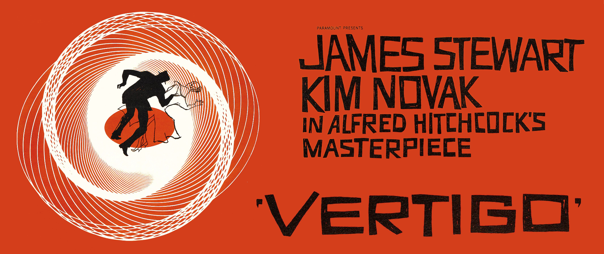
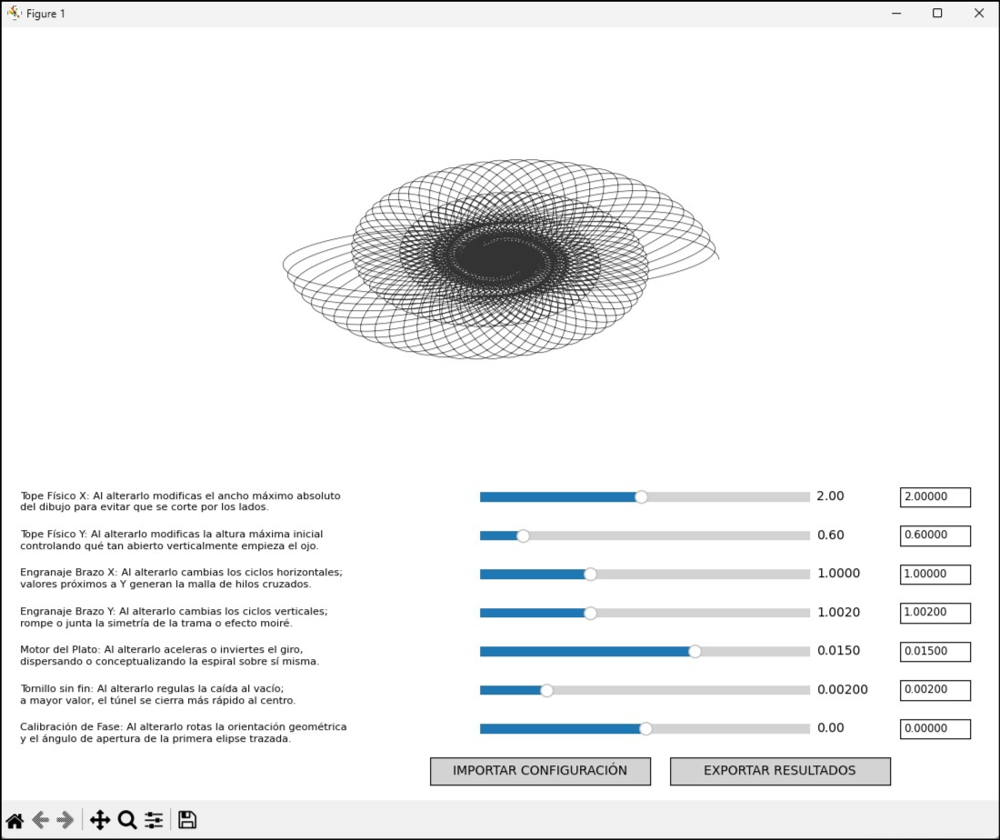

## M-5 Vertigo Simulator

**M-5 Vertigo Simulator** es un motor de renderizado matemático desarrollado en **Python** que emula la lógica física y mecánica del  **Director de Tiro M-5** , la computadora analógica de la Segunda Guerra Mundial que **John Whitney** transformó para crear las icónicas espirales del cartel y la secuencia de créditos de la película *Vértigo* (1958) de Alfred Hitchcock.

## 🖼️ Referencias Visuales

### El Cartel de Saul Bass (1958)

El diseño original utiliza una **espiral hipnótica** (curvas de Lissajous) en color naranja vibrante sobre un fondo negro profundo para evocar la desorientación y el malestar psicológico del protagonista.

### La Máquina: Director de Tiro M-5

Este "espirógrafo gigante" era un objeto de ingeniería pesada de  **400 kilos y 4 metros de altura** . No utilizaba software; funcionaba mediante la transmisión de movimiento físico a través de **ejes y engranajes reales** de alta precisión.

### Interfaz de la Aplicación

El simulador digital traduce estos controles mecánicos a una interfaz funcional que permite manipular la geometría en tiempo real.


*Captura de la interfaz de control con visualización de la malla de interferencia generada por el simulador.*

## 🎯 Objetivo del Proyecto

El propósito de este simulador es **emular la pureza mecánica** del proceso analógico original. A diferencia de un software de dibujo convencional, este motor modela tres sistemas independientes que se ejecutan en paralelo, tal como lo hacía la M-5:

1. **Oscilación Armónica:** Brazos mecánicos que definen la elipse base.
2. **Mecanismo de Reducción:** Un "tornillo sin fin" que reduce la amplitud hacia el centro, creando el efecto de túnel.
3. **Rotación de Plataforma:** Un motor que gira el material fotosensible a velocidad constante.

## ✨ Características Principales

* **Topes de Acero:** Implementación de límites físicos ($A_x, A_y$) que garantizan que el rastro de luz jamás escape del radio definido por el armazón mecánico.
* **Precisión de Engranajes:** Control de frecuencias ($f_x, f_y$) para recrear las **mallas de hilos cruzados** mediante desfases sutiles (ej. 1.000 vs 1.002).
* **Amortiguación Orgánica:** Parámetro de reducción ($k$) que emula la fricción natural del péndulo de pintura utilizado por Whitney.
* **Exportación de Resultados:** Capacidad para guardar el arte generado en múltiples formatos:
  * **Rasterizados:** PNG y JPG para previsualización rápida.
  * **Vectoriales:** **SVG** para diseño gráfico de alta resolución y trazado vectorial preciso.
* **Gestión de Informes:** Sistema para  **exportar e importar archivos de configuración** , permitiendo guardar los cálculos exactos de una espiral para replicarlos en otros equipos.

## 📋 Requisitos Previos

* **Python 3.x**
* **NumPy:** Para el procesamiento de matrices de rotación y cálculos trigonométricos.
* **Matplotlib:** Para la visualización de la larga exposición y exportación de archivos.

## ⚙️ Instrucciones de Instalación

1. Clona el repositorio:
   ```
   git clone https://github.com/juanmiguelkonectia/Vertigo.git
   ```
2. Accede al directorio del proyecto:
   ```
   cd Vertigo
   ```
3. Instala las dependencias:
   ```
   pip install numpy matplotlib
   ```

## 🚀 Cómo usarlo (Ejemplos)

Para obtener el **"Óvalo de Saul Bass"** (relación de aspecto 1.25) con la densidad característica del cartel, utiliza los siguientes parámetros en el simulador o impórtalos mediante un archivo de configuración:

```
# Parámetros históricos para emular la M-5
Ax, Ay = 2.25, 1.80    # Topes de acero (Relación de aspecto 1.25)
fx, fy = 1.0, 1.00018  # Engranajes (Malla ultra-densa)
delta = 0.08000        # Calibración de brazos (Ángulo de inicio histórico)
k = 0.00065            # Tornillo sin fin (Amortiguación del péndulo)
omega = 0.1            # Motor de la plataforma (Velocidad de giro)
```

*Este ajuste generará aproximadamente **74 órbitas entrelazadas** antes de que el trazo colapse en el centro.*

## 📄 Licencia

Este proyecto está bajo la licencia [CC BY-NC 4.0](https://creativecommons.org/licenses/by-nc/4.0/deed.es). Puedes compartir y adaptar el contenido siempre que des crédito y **no lo utilices con fines comerciales**.
Permitiendo su uso libre para fines educativos, artísticos y de investigación sobre la historia del diseño computacional.. El código es abierto, pero se requiere el reconocimiento explícito del autor mencionado en la sección de créditos en cualquier derivado o uso público del mismo.

---

*Este simulador es un homenaje a la ingeniería analógica de John Whitney y la visión minimalista de Saul Bass.*
